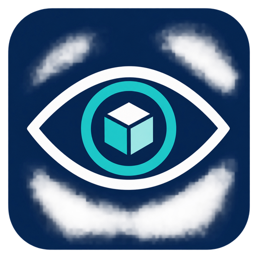
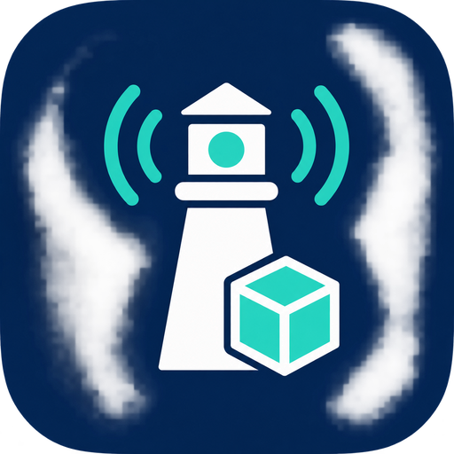

# VMware Vision for Splunk

| VMware Vision app | VMware Vision ingestion TA |
|:---:|:---:|
|  |  |

VMware Vision turns recorded VMware syslog events into a VM activity trail: creation, changes, removal, power operations, migrations, snapshots, users and failures.

The app works with logs already collected from vCenter, ESXi and Aria. It does not poll VMware APIs, collect live inventory or change VMware configuration. API polling may be considered for a future release; it is not included in version 1.1.1.

## Packages

| Package | Version | Install on | Download |
|---|---|---|---|
| `vmware_vision` | 1.1.1 | Search heads or a standalone Splunk instance | [App archive](https://github.com/majidershadi/vmware-vision/releases/download/v1.1.1/vmware_vision-1.1.1.tar.gz) |
| `TA-vmware-vision` | 1.0.2 | The heavy forwarder or indexers that first parse raw VMware logs | [TA archive](https://github.com/majidershadi/vmware-vision/releases/download/v1.1.1/TA-vmware-vision-1.0.2.tar.gz) |

The technical add-on supplies event boundaries, timestamp settings and character encoding. Search-time field extraction, dashboards, reports and CIM mappings belong to the full app. Neither package enables a listener, creates an index or configures forwarding.

Both installation archives, checksums and AppInspect reports are on the [current release page](https://github.com/majidershadi/vmware-vision/releases/tag/v1.1.1). The source ZIP is a development tree and cannot be installed directly as a Splunk app.

Both packages share this repository so their raw parsing settings stay synchronized. They have separate versions, install archives and icons: the eye and VM for the app, and the beacon and VM for the TA.

For TA setup, follow [TA configuration](docs/TA_CONFIGURATION.md). The latest TA release changes its icon and setup documentation; parsing behavior remains unchanged.

## Start here

1. Read [installation and configuration](docs/INSTALLATION.md).
2. Choose the correct tiers using [distributed deployment](docs/DEPLOYMENT.md).
3. Set `vmware_vision_indexes` to your VMware indexes.
4. Check parsing with a small time window before enabling [data-model acceleration](docs/DATA_MODELS.md).
5. For Enterprise Security, follow [CIM Authentication and Change setup](docs/CIM.md).

For development, see [building from source](docs/BUILD.md), [parser design](docs/ARCHITECTURE.md) and [troubleshooting](docs/TROUBLESHOOTING.md).

## Views

| View | Purpose |
|---|---|
| VMware Overview | Counts, categories, latest VM activity, users and failures |
| VM History | Event trail and last successfully observed state |
| Configuration and Change Audit | Configuration, rename, migration and snapshot details |
| Operations and Security | Authentication, permissions, alarms, host events and tasks |
| Setup and Coverage | Source freshness, parsing status and identity quality |
| Accelerated Activity | Optional aggregate trends from summarized data |
| Configuration | UCC application logging settings |

`vmware_action` keeps native operation names such as `power_on` and `reconfigured`. For eligible CIM events, `action` contains the CIM value, such as `started`, `modified`, `success` or `failure`.

## Reading coverage results

VMware Vision is intended to help audit meaningful VM lifecycle, configuration and security events. Coverage charts describe the received syslog mix; they are not a score for audit accuracy. A busy source can produce many service messages with no VM operation to extract. Raw events remain searchable; an unsupported message does not by itself mean ingestion failed.

| Field or label | Meaning | What to check |
|---|---|---|
| `lookup_missing` or a search placeholder such as `MISSING` | Expected normalization fields are absent. These labels are added by the dashboard or diagnostic search. | Lookup errors, parser errors, matching, local overrides and search-bundle versions on each peer. |
| `record_kind=unclassified`, usually `parser_status=unmapped` | The parser returned a result but did not recognize a supported message shape. | Inspect a sample. It may be routine service output, a useful unsupported event or a fragment. |
| `parser_status=unmapped_event_type` | An event-type name was extracted but has no mapped operation. | Verify the underlying record and report a sanitized example. It is not proof of a completed VM change. |
| `record_kind=diagnostic` | A recognized service-log format. | Keep it for troubleshooting. Diagnostic does not mean harmless; service errors can matter. |
| `identity_quality=missing` | No VM name, managed object ID or UUID was extracted. | On VM event candidates, compare with the raw message: data may be absent, ambiguous, incomplete or missed by the parser. |
| `parser_status=mapped` | The parser selected a known operation. | Validate the VM, actor and outcome against the raw event. Mapping is not a guarantee that every field or classification is correct. |

The VM identity panel evaluates VM event candidates, not all incoming syslog. Its missing identities therefore need investigation; routine non-VM traffic alone does not explain that panel. Reconfiguration's `message only` label means no structured change details were extracted. It does not establish that the source supplied none.

### Known 1.1.1 audit limitations

Production samples reviewed after release exposed these unresolved parser issues:

- Name-first power messages such as `example-vm on host.example.test in DC is powered off` and `Message on example-vm ...` can retain their event type while losing the VM name.
- InventoryMonitor diagnostics that only say `Event value type: vim.event.VmPoweredOffEvent` can be incorrectly mapped as completed power-off events and enter CIM Change. A `mapped` filter alone does not remove this case.
- Reconfiguration sections named `Modified:`, `Added:` and `Deleted:` are not fully covered by the current detail extraction.
- Incomplete bracketed event records can fall back to generic key/value extraction and incorrectly use a nested device/configuration `key` as `event_id`. Multiple stored records with the same header event ID and different portions of the body suggest fragmentation, but do not establish where it occurred. A closing bracket alone does not prove completeness.

These issues require a parser update; this documentation change does not fix them. Version 1.1.1's whitespace lookup fix remains valid, but it does not resolve every missing identity or unsupported format. Check affected VM histories and CIM Change results against the original events before treating their counts or observed state as authoritative.

The development priority is correct event identity, VM identity, outcome and supplied change details. Routine diagnostic classification is secondary. Fragment reassembly requires reliable origin/event/fragment information; joining nearby records by timestamp alone is unsafe. Acceleration improves query performance but cannot repair classification or incomplete content. No change to the ingestion TA, collection filtering or retention is made by this documentation update.

See [troubleshooting](docs/TROUBLESHOOTING.md) for searches that distinguish missing lookup output from unsupported messages. Share sanitized examples through [GitHub Issues](https://github.com/majidershadi/vmware-vision/issues).

## Compatibility and limits

The standalone validation environment uses Splunk Enterprise 10.4.1 with Splunk_SA_CIM 8.7.0. Runtime checks cover Python 3.9 and 3.13. Splunk 10.0.2 remains a compatibility target; distributed acceptance on that release is not claimed. On Splunk versions that support `python.required`, the highest installed declared runtime is selected. The legacy fallback is `python.version=python3.9`.

The VMware dashboards and custom models do not require CIM. CIM is required to use its Authentication and Change models. Use the CIM version supported by your Enterprise Security deployment.

Missing source fields stay missing. A request is not treated as a completed operation. Last observed state is not current inventory. Aria appliance diagnostics alone do not provide a complete VM audit history. See [coverage and limitations](docs/ARCHITECTURE.md).

AppInspect reports accompany release artifacts. Passing local checks is not a claim of Splunkbase approval, Splunk Cloud certification or support for every ES detection.

## Upgrading to 1.1.1

Read the [1.1.1 release notes](docs/RELEASE_1.1.1.md) for fixes, installation tiers, validation, known limitations and rollback.

This patch fixes lookup matching for whitespace-bearing records and improves classification of the documented ESXi and service-log formats. Upgrade the full app; TA 1.0.2 remains unchanged. No reindexing is required. Rebuild affected accelerated summaries when historical corrected results are needed. Embedded CRLF matching remains a [known limitation](docs/TROUBLESHOOTING.md#remaining-embedded-crlf-limitation).

## Upgrading from 1.0.x

Back up local configuration. Update custom searches from native `action` filters to `vmware_action`, review local lookup output lists, and rebuild any enabled VMware model summaries. The bundled dashboards are already migrated. The 1.0.1 ingestion add-on changes packaging and licensing; its raw parsing settings are unchanged from 1.0.0.

## License and support

Copyright 2026 Majid Ershadi. Licensed under [Apache 2.0](LICENSE). Bundled dependencies retain their own licenses.

Use [GitHub Issues](https://github.com/majidershadi/vmware-vision/issues) for bugs and feature requests. Include the app and Splunk versions, the search app context, a sanitized event and the expected result. Do not include passwords, tokens or unredacted customer logs.

VMware Vision is an independent project and is not an official VMware, Broadcom or Splunk product.
